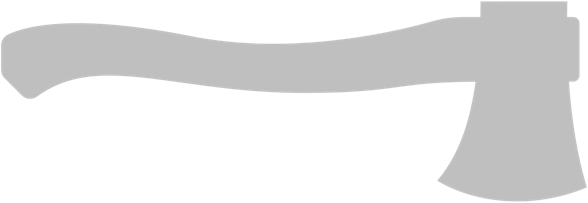

# bunyan

chop down logs



Track software performance and runtime operations while incurring a low overhead.  Get full workflow logging and telemetry
with a single call to an output stream and to a metrics endpoint.

Bunyan is built to be convenient for local development without sacrificing efficiency for running at scale.  Great for software development
and not overpaying for extra IOPS for logging or events on rented compute.


### design

#### dependencies

Only the Golang standard library is required as a dependency.  By design, Bunyan does not, and will not, require third party libraries.

The intent is that you're only required to update Bunyan when you want new features, not to address issues in dependencies.

#### architecture

Architecturally, a hierarchical model of scopes is employed:

```
manager
-> zone
--> chain
----> span
```


Where under the hood, this is modeled as:

```
manager
-> zone
---> chain
------> categories
--------> entries
----------> span
```

The complexity of this hierarchy allows for flexible, organized metric tracking and increased performance.  This performance gain comes from 
an outsized decrease in CPU burden at the expense of a small amount of memory as usage of Bunyan increases.

In practice, a common use case is as follows:
- a manager is initialized
- a zone is created, which is used for very broad groupings
- a chain is used as a composite for related spans, such as functions called to handle a web request.
- categories can be used to add metadata or organize spans
- entries are groupings of spans under a given category
- spans track the start, end of work

The lifecycle duration is logically expected to decrease as you descend further into scopes 
(you may choose one manager per process, but use many spans within a single function). 

As an example, usage in a network application usage may look like:

```
manager
-> zone open: background caches
--> chain: assets       {categories: image, video}
--> chain: templates    {categories: reports, content}
-> zone: handlers
--> chain: handle request 1
---> span category: templating
---> span category: database calls
--> chain: handle request 2
---> span category: templating
---> span category: file download        
```

to get insight, simply generate a report at any point (even before zones, chains, spans are complete).


#### context and termination

Attention has been invested in automatically "safely doing the right thing" when shutting down or stopping operation of scopes.

Each layer has access to the N-1 layer context for graceful shutdown.   Layers do not cancel the context of parent layers, they simply observe when the context terminates.

### contributions and feedback

#### Feature requests

Open a GitHub issue describing your request, your intended use cases, and pseudo-code examples of usage.  

#### Code contributions 

Open a PR with supporting tests.  Please be aware ahead of putting in effort that I may not accept your code contribution based on 
quality, feature direction, performance concerns, or other criteria.

### ai disclosure

Usage:

- not used

### license

[Available here](./LICENSE)